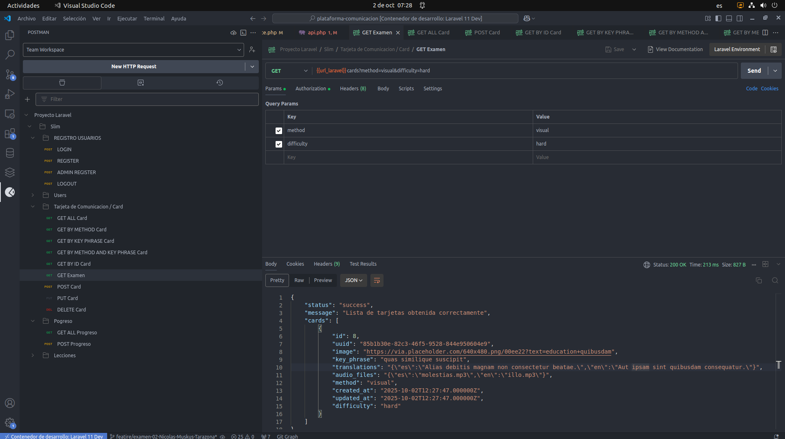

# Filtro Postman 
#### Filtro postman puerto 8080 
```
php artisan key:generate
php artisan serve --host=0.0.0.0 --port=8080
```
#### URL POSTMAN
```
{{url_laravel}}cards?method=visual&difficulty=hard
```
#### Para verificar desde postman el token debe ser de un administrador , GENERAR TOKEN ADMIN 
```
php artisan db:seed --class=AdminSeeder
```
#### Refrescar proyecto
```
php artisan migrate:fresh --seed
```

